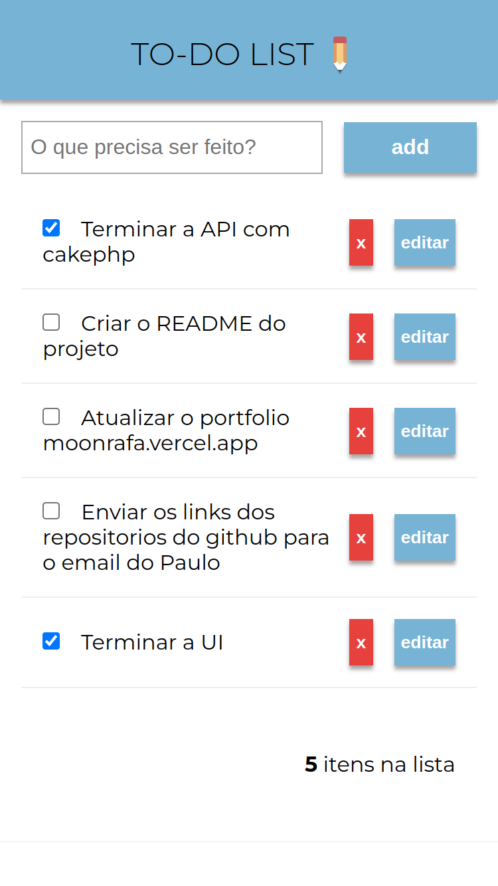

<a name="readme-top"></a>	
	<div align="center">
		<h3 align="center">Fullstack to-do list using Angular and CakePHP 📝 </h3>
			<p align="center">
				<a href="{livesite}"><strong>Explore the App </strong></a>
				<br />
				<a href="{livesite}">View Demo</a> -
				<a href="https://github.com/moonrafa/to-do-list/issues">Report Bug</a> -
				<a href="https://github.com/moonrafa/to-do-list/issues">Request Feature</a>
				</p>
			</div>
			<details>
				<summary>Table of Contents</summary>
				<ol>
					<li>
						<a href="#about">About</a>
					 <ul>
							<li><a href="#built-with">Tools</a></li>
						<li><a href="#about-the-project">Demo</a> </li>
						</ul>
					</li>
					<li>
						<a href="#getting-started">Getting Started</a>
						<ul>
							<li><a href="#prerequisites">Prerequisites</a></li>
							<li><a href="#installation">Installation</a></li>
						</ul>
					</li>
					<li><a href="#contact">Contact</a></li>
				</ol>
			</details> 

## Tools

- [![Typescript][typescript]][typescript-url]
- [![Angular][angular]][angular-url]
- [![PHP][php]][php-url]
- [![MariaDB][mariadb]][mariadb-url]
  
## Demo
- desktop
  </br>
	</br>
	

- mobile
  </br>
	</br>
	

<p align="right">(<a href="#readme-top">back to top</a>)</p>

## Getting Started
### Prerequisites
- backend
  - php
  - composer
  - cakephp3
  - any sql database
- frontend
  - npm
  - nodejs
  - angular-cli

### Database
```sh
- CREATE TABLE todo (id int(11) NOT NULL AUTO_INCREMENT, body VARCHAR(255) NOT NULL, complete BOOLEAN DEFAULT FALSE, PRIMARY KEY (id));
```
### Run
- backend
  ```sh
  cd backend
	```
  ```sh
  bin/cake server
  ```

- frontend
  ```sh
	cd frontend
  ```
	```sh
	ng serve
	```


  
## Contact
  [![Linkedin][linkedin]][linkedin-url]
</br>
	Rafaelly Rodrigues - rrafasrodrigues@gmail.com
			
[linkedin]: https://img.shields.io/badge/-LinkedIn-black.svg?style=for-the-badge&logo=linkedin&colorB=555
[linkedin-url]: https://www.linkedin.com/in/moonrafa/
[demo]: frontend/src/assets/demo-desktop.png
[demo2]: frontend/src/assets/demo-mobile.png
[mariadb]: https://img.shields.io/badge/MariaDB-01529E?style=for-the-badge&logo=mariadb&logoColor=white
[mariadb-url]: https://mariadb.org/
[angular]: https://img.shields.io/badge/Angular-DD0031?style=for-the-badge&logo=angular&logoColor=white

[angular-url]: https://angular.io/
[php]: https://img.shields.io/badge/PHP-777BB4?style=for-the-badge&logo=php&logoColor=white
[php-url]: https://www.php.net/

[typescript]: https://img.shields.io/badge/TypeScript-007ACC?style=for-the-badge&logo=typescript&logoColor=white
[typescript-url]: https://www.typescriptlang.org/*/